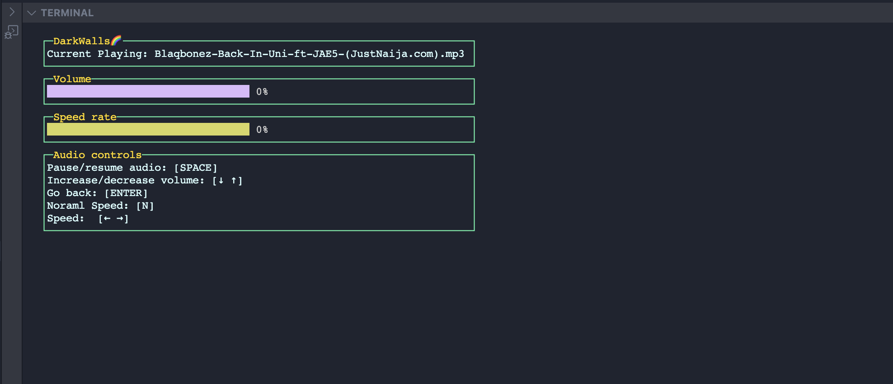

<p align="center">
  
</p>

# DarkWalls🌈 CLI Audio player

DarkWalls🌈 is a simple music player of the CLI, by the CLI and for the CLI (pun intended). DarkWalls audio player currently has supports for `WAV`, `MP3`, `OGG`, and `FLAC` audio formats.

## Install
Clone source files from GitHub to build/run the program. Ensure to have [Go](https://go.dev/) installed and setup, then clone by running this command:
```
git clone https://github.com/IkehAkinyemi/DarkWalls.git
```

Change directory into the project and see [Usage](#usage).

## Usage
Specify the absolute path to your music directory using the `-music-dir=<directory>` flag like below.

```sh
 make audio -dir=<directory>
```
You can use the sample music contained in the `sampleMusic` folder to test the project as below:

```sh
make cmd/app
```

### Build
The following command will produce a linux_amd64 compatible binary. Feel free to update the Makefile commands to best suit your platform.

```sh
make build/app
```

### Audit
The following command will format and audit the codebase

```sh
make audit
```

